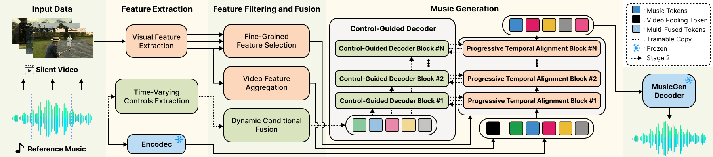

# Controllable Video-to-Music Generation with Multiple Time-Varying Conditions

**This project has been accepted to ACMMM 2025! 🚀🚀🚀**

## ✨ Abstract

Music enhances video narratives and emotions, driving demand for automatic video-to-music (V2M) generation. However, existing V2M methods relying solely on visual features or supplementary textual inputs generate music in a black-box manner, often failing to meet user expectations. To address this challenge, we propose a novel multi-condition guided V2M generation framework that incorporates multiple time-varying conditions for enhanced control over music generation. Our method uses a two-stage training strategy that enables learning of V2M fundamentals and audiovisual temporal synchronization while meeting users’ needs for multi-condition control. In the first stage, we introduce a fine-grained feature selection module and a progressive temporal alignment attention mechanism to ensure flexible feature alignment. For the second stage, we develop a dynamic conditional fusion module and a control-guided decoder module to integrate multiple conditions and accurately guide the music composition process. Extensive experiments demonstrate that our method outperforms existing V2M pipelines in both subjective and objective evaluations, significantly enhancing control and alignment with user expectations.

## ✨ Method

  

